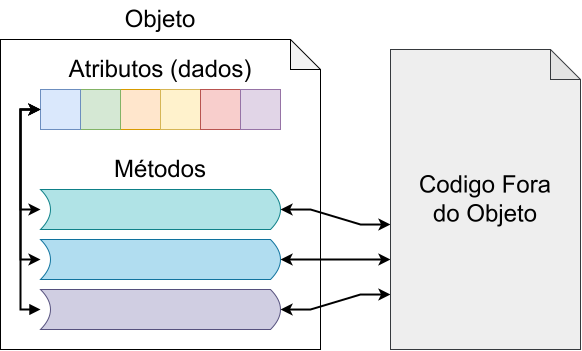

<style>
    section {
        font-size: 24pt;
    }
    .columns {
        display: grid;
        grid-template-columns: repeat(2, minmax(0, 1fr));
        gap: 1rem;
    }
</style>

# Introdução à Programação em


https://evandro-crr.github.io/intro-python

<!-- _footer: Evandro Chagas Ribeiro da Rosa -->
<!-- _paginate: skip -->

---

## Introdução a Classes

- A **programação procedural** é centrada
  no uso de procedimentos/funções.
- Enquanto a **programação orientada a objetos** (POO)
  é centrada no uso de objetos.
- Um **objeto** é criado a partir de um tipo abstrato
  de dados (**classe**) que encapsula tanto dados
  quanto funções.

---

## Exemplo de Programação

<div class="columns">
<div>

#### Procedural

```py
def area_retangulo(largura, altura):
    return largura * altura


retangulo = (10, 20)
print(area_retangulo(*retangulo))
# 200
print(type(retangulo))
# <class 'tuple'>
```

</div>
<div>

#### Orientada a Objetos

```py
class Retangulo:
    def __init__(self, largura, altura):
        self.largura = largura
        self.altura = altura

    def area(self):
        return self.largura * self.altura

retangulo = Retangulo(10, 20)
print(retangulo.area())
# 200
print(type(retangulo))
# <class '__main__.Retangulo'>
```

</div>
</div>

---

# Encapsulamento

<div class="columns">
<div style="margin: auto">

```py
class Retangulo:
    def __init__(self, largura, altura):
        self.largura = largura  # 🡸 Atributo
        self.altura = altura    # 🡸 Atributo

    def area(self):  # 🡸 Método
        return self.largura * self.altura

# ⬐ Objeto
retangulo = Retangulo(10, 20)
```

Um objeto contém:
- **Dados**
  chamados de atributos.
- **Funções**
  chamados de métodos.

</div>
<div style="margin: auto">



</div>
</div>

---

<div class="columns">
<div style="">

```python
from datetime import datetime

class Pessoa:
    def __init__(self, nome_completo:
                 str, data_nascimento):
        nomes = nome_completo.strip().title().split()
        self.primeiro_nome = nomes[0]
        self.nome_meio = nomes[1:-1]
        self.ultimo_nome = nomes[-1]
        self.nascimento = data_nascimento

    def nome(self):
        return self.primeiro_nome

    def nome_completo(self):
        nome_meio = " ".join(
            map(lambda n: n[0] + ".", self.nome_meio))
        return f"{self.primeiro_nome} "\
               f"{nome_meio} {self.ultimo_nome}"

    def idade(self):
        return datetime.now().year - self.nascimento

    def __str__(self):
        return f"{self.nome_completo()} "\
               f"({self.idade()})"
```

</div>
<div style="">

# Abstração

- Os métodos formam a interface do objeto.
- A estrutura interna pode mudar sem mudar a interface.

```python
pessoa = Pessoa("Maria Santos Oliveira", 1990)
print(pessoa.nome_completo())
# Maria S. Oliveira
print(pessoa.idade())
# 34
print(pessoa)
# Maria S. Oliveira (34)
```

</div>
</div>

---

# Objeto na Vida Cotidiana

<div class="columns">
<div style="">


</div>
<div style="">

- Os pedais e o volante são uma interface para o carro.
- Não é necessário ser mecânico para dirigir um carro.
  
- Não é necessário entender como a classe é criada para usá-la, apenas conhecer sua interface.

</div>
</div>

---

## Classes e Objetos

- Uma classe é uma entidade que descreve um
  objeto, mas não é o objeto em si.
- O objeto é construído a partir de uma classe.
- Dizemos que um objeto é uma instância de uma classe.

**Exemplo**:
- A planta de uma casa é uma classe.
- A casa construída a partir da planta é um objeto.
- Podemos construir diversas casas com base na mesma planta.

---

## Exemplo: Classe Aluno

Crie uma classe `Aluno` que armazena
informações sobre um aluno e suas notas.

<div class="columns">
<div style="">

**Dados**:
- O nome do aluno.
- A idade do aluno.
- Uma lista de notas do aluno (valores entre 0 e 10).

</div>
<div style="">

**Métodos**:
- Adiciona uma nota à lista de notas do aluno.
- Calcula e retorna a média das notas do aluno.
- Retorna se está aprovado ou reprovado baseado na média das notas.

</div>
</div>

---

## Exemplo: Classe Turma

Crie uma classe `Turma` que gerencia vários alunos e suas notas.

<div class="columns">
<div style="">

**Dados**:
- O nome da turma.
- A lista de alunos
  (objetos da classe `Aluno`).

</div>
<div style="">

**Métodos**:
- Adiciona um aluno à turma.
- Adiciona notas dos alunos.
- Calcula a média da turma.

</div>
</div>

---

## ⚙ Exercício: Classe Conta Bancária

Crie uma classe `ContaBancaria` que simula uma conta bancária, permitindo realizar depósitos, saques e consultar o saldo.

<div class="columns">
<div style="">

**Dados**:
- O titular da conta
  (nome do proprietário).
- O número da conta
  (um identificador único).
- O saldo da conta
  (valor inicial de 0).

</div>
<div style="">

**Métodos**:
- Realiza um depósito na conta, somando o valor ao saldo.
- Realiza um saque, subtraindo o valor do saldo (não permitindo saldo negativo).
- Exibe o saldo atual da conta.
- Exibe o nome do titular e o número da conta.

</div>
</div>

---

# Sobrecarga de Operadores

É possível definir o comportamento de um
operador para objetos da classe: `self · other`

| Método                      | Operador |
| :-------------------------- | -------- |
| `__add__(self, other)`      | +        |
| `__sub__(self, other)`      | -        |
| `__mul__(self, other)`      | *        |
| `__truediv__(self, other)`  | /        |
| `__floordiv__(self, other)` | //       |

---

# Exemplo: Classe Ponto2D

<div class="columns">
<div style="">

```py
class Ponto2D:
    def __init__(self, x, y):
        self.x = x
        self.y = y

    def __add__(self, other):
        return Ponto2D(self.x + other.x,
                       self.y + other.y)

    def __sub__(self, other):
        return Ponto2D(self.x - other.x,
                       self.y - other.y)

    def __mul__(self, other):
        if isinstance(other, (int, float)):
            return Ponto2D(self.x * other,
                           self.y * other)
        return Ponto2D(self.x * other.x,
                       self.y * other.y)

    def __repr__(self):
        return f"Ponto2D({self.x}, {self.y})"
```

</div>
<div style="">

```py
vetor1 = Ponto2D(3, 4)
vetor2 = Ponto2D(1, 2)

# Adição de pontos
vetor_soma = vetor1 + vetor2
print(vetor_soma)
# Ponto2D(4, 6)

# Subtração de pontos
vetor_subtracao = vetor1 - vetor2
print(vetor_subtracao)
# Ponto2D(2, 2)

# Multiplicação de ponto por escalar
vetor_multiplicado = vetor1 * 2
print(vetor_multiplicado)
# Ponto2D(6, 8)

# Multiplicação de pontos
vetor_multiplicado2 = vetor1 * vetor2
print(vetor_multiplicado2)
# Ponto2D(3, 8)
```

</div>
</div>

---

# Sobrecarga de Operadores

Se `type(x).__add__(x, y)` não for implementado, `type(y).__radd__(y, x)` é chamado.

| Método                      | Operador |
| :-------------------------- | -------- |
| `__radd__(self, other)`     | +        |
| `__rsub__(self, other)`     | -        |
| `__rmul__(self, other)`     | *        |
| `__rtruediv__(self, other)` | /        |

[🔗 Outros Operadores](https://docs.python.org/3/reference/datamodel.html#emulating-numeric-types)

---

## Exemplo: Classe Pessoa

Crie uma classe que representa uma pessoa.

<div class="columns">
<div style="">

**Dados**:
- O nome da pessoa.
- A idade da pessoa.
- A altura da pessoa.
- O peso da pessoa.

**Operadores**:
- `==`: Compara duas pessoas.
- `str`: Retorna uma string.

</div>
<div style="">

**Operadores**:
- `+`: Cria uma nova `Pessoa` com o nome concatenado, soma das idades, média das alturas e pesos.
- `-`: Cria uma nova `Pessoa` com menor nome, e as diferenças absolutas de idade, altura e peso.

</div>
</div> 

---

## ⚙ Exercício: Classe Data

Crie uma classe `Data` que representa uma data (dia, mês e ano), e implemente a sobrecarga de operadores.

<div class="columns">
<div style="">

**Dados**:
- O dia (número inteiro).
- O mês (número inteiro).
- O ano (número inteiro).

</div>
<div style="">

**Operadores**:
- `+`: Soma dias a uma data.
- `-`: Subtrai dias de uma data.
- `==`: Compara se duas datas são iguais.
- `str`: Retorna uma string representando a data no formato `"dd/mm/aaaa"`.

</div>
</div>

---

# Introdução à Programação em


https://evandro-crr.github.io/intro-python


<!-- _footer: Evandro Chagas Ribeiro da Rosa -->
<!-- _paginate: skip -->
